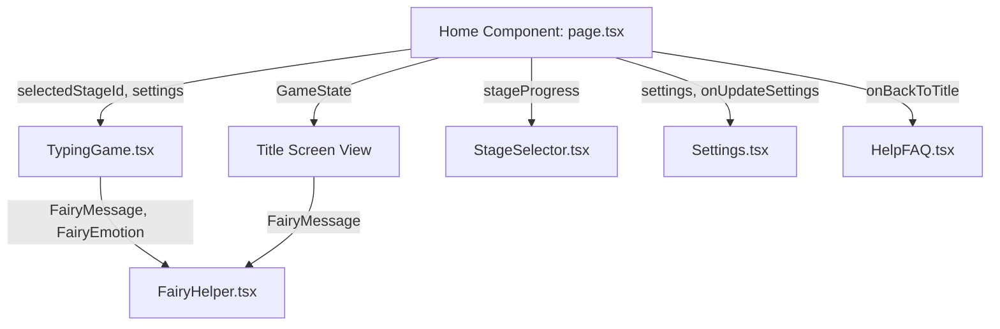
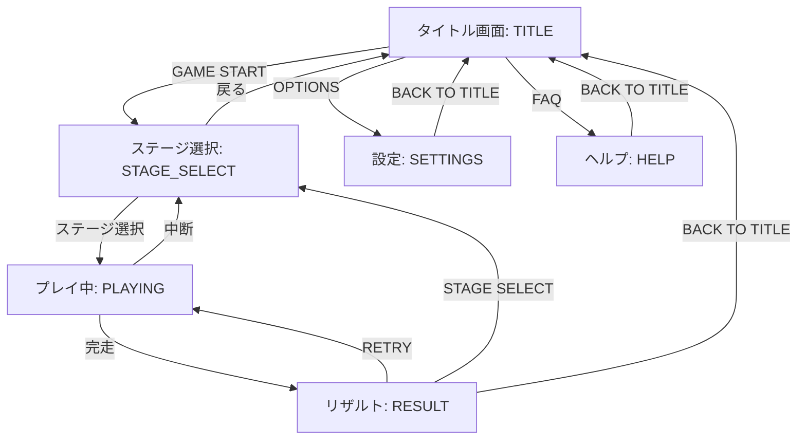
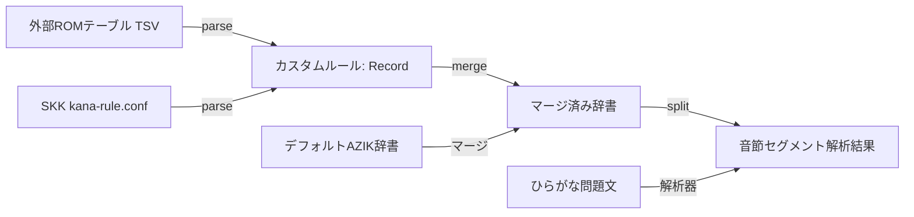

# AZIKタイピング養成妖精 (azik-fairy) — 技術設計

## アーキテクチャ

本アプリケーションは、**Next.js (App Router) + Tailwind CSS v4** のモダンなスタックを利用した、完全クライアントサイド動作のフロントエンドSPA（Single Page Application）です。サーバーサイドDBを持たず、静的エクスポート (`output: 'export'`) を行い、GitHub Pages 等の静的ホスティング環境へ簡単に展開できる設計となっています。

### コンポーネントツリーと状態管理
`src/app/page.tsx` を最上位のステートコントローラー（状態機械）とし、ゲーム画面（`TypingGame`）、ステージ選択（`StageSelector`）、設定（`Settings`）、ヘルプ（`HelpFAQ`）の各コンポーネントを切り替えます。



### 画面遷移状態（`GameState`）



---

## データフロー

### 1. カスタムローマ字定義の解析と適用
Google日本語入力のローマ字表（TSV）やSKKの `kana-rule.conf` は、パーサー `parseExternalRomajiTable` により、主要なAZIK定義キーへと自動抽出されます。その後、デフォルト辞書とマージされた上で、動的にひらがな文字列のセグメント解析へ引き渡されます。



### 2. キー入力の判定アルゴリズム (STRICT vs NORMAL)
キー押下（KeyDown）時、現在の音節（セグメント）における許容打鍵パターンとバッファを比較し、ゲーム進行とミス判定を決定します。

```mermaid
graph TD
  KeyDown[キー押下 event.key] --> CheckPrefix{入力バッファ + key が<br/>許容パターンの前方一致か？}
  
  CheckPrefix -->|Yes| UpdateBuffer[入力バッファを更新 / 正解音]
  UpdateBuffer --> CheckComplete{入力バッファが<br/>許容パターンと完全一致？}
  CheckComplete -->|Yes| NextSegment[次の音節 / 単語へ移行 / バッファクリア]
  CheckComplete -->|No| WaitNext[次のキー入力を待機]

  CheckPrefix -->|No| CheckStrict{設定: isStrict == true ?}
  CheckStrict -->|Yes (強制モード)| IgnoreKey[キー入力を無視 / 画面揺れ警告 / ミス数非加算]
  CheckStrict -->|No (ノーマル)| MissKey[ミス数加算 / ミス音 / 次のキー入力を待機]
```

---

## 主要な設計意思決定

| 決定事項 | 採用方式 | 代替案 | 理由 |
|----------|--------|--------------|--------|
| **ホスティング環境** | 静的エクスポート (`output: 'export'`) | Next.js Server SSR | 完全無料で高速な GitHub Pages / Cloudflare Pages への配信を可能にし、運用コストをゼロにするため。 |
| **判定方式** | 子音＋母音拡張をマージした音節分解器 | キーイベントごとの文字マッピング変換 | 「〜あん」➔ `z` のようなAZIK独自の末尾拡張キーは、先行する子音と結びついた音節（「かん」➔ `kz`）としてパースしないと、誤入力を防ぐキー判定が難しいため。 |
| **外部定義のインポート** | 1文字マッピングの抽出と芋づる式置換 | 変換辞書全体の完全置換 | 外部定義ファイル（`kana-rule.conf`など）の全ルールを愚直に適用すると、AZIK以外の通常ローマ字部分のパースが崩れる恐れがあるため。主要なAZIKショートカットキー（ん、っ、撥音、二重母音の親キー）のみを抽出し、子音との組み合わせは内部で自動展開する方式としました。 |
| **進捗・設定の永続化** | LocalStorage | クラウドDB (Firebase等) | 個人情報の管理や認証実装の手間を排除し、ユーザーの手元だけで安全に進捗が完結するようにするため。 |

---

## 制約と前提条件

- **キーボード要件**: 本アプリは、JIS配列またはUS配列のPC用物理キーボードでの入力を想定しています。モバイルデバイスの仮想キーボードやフリック入力には対応していません。
- **ブラウザ要件**: `localStorage` を利用するため、ブラウザのCookieやストレージが無効化されている環境（一部の極端なシークレットウィンドウ等）では、クリア状態や設定が保存されません。

## 関連項目

- [概要 (Overview)](./overview.md)
- [利用ガイド (Guide)](./guide.md)
